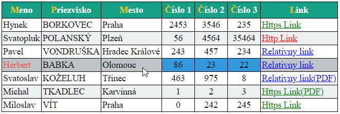
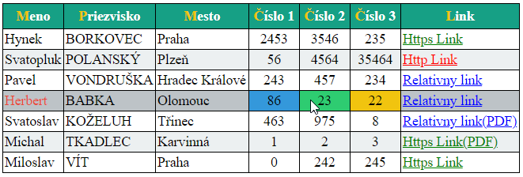
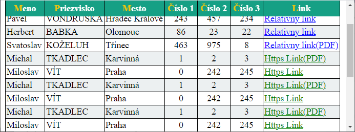

# VAII Cvičenie 02

Momentálne je otvorená branch __MAIN__, ktorá obsahuje _štartér_. Riešenie obsahuje branch  __SOLUTION__.

Toto cvičenie precvičuje základné operácie s _CSS_, _CSS possition_ a _CSS selektormi_.

## Úloha č. 1

Cvičenie pondelok 8:00

Upravte HTML v súbore `obloha\index.html` tak, aby vyzeral ako na nasledujúcom obrázku:

Riešenie musí spĺňať nasledujúce podmienky:

- Obrázok oblohy bude roztiahnutý na celé okno prehliadača.
- Uprostred neho bude obrázok slnka a v každom rohu obrázok vtáčika.
- Pri zmene veľkosti okna prehliadača musia obrázky zostať na svojom mieste (slnko v strede a vtáčiky na okrajoch).
- Všetky vtáčiky budú otočené smerom k slnku.

## Úloha č. 2:

Naštýlujte pomocou CSS tabuľku v súbore `selektory\index.html` podľa priloženého obrázku:

Riešenie musí spĺňať nasledujúce podmienky:

1. Tabuľka bude mať čierny rámček medzi bunkami a okolo celej tabuľky.
2. Záhlavie tabuľky bude mať zelenú farbu pozadia, text bude tučným písmom a bude centrovaný, prvé písmeno bude mať žltú farbu.
3. Každý nepárny riadok tabuľky bude mať svetlosivé pozadie.
4. Stĺpec s priezviskami bude napísaný veľkými písmenami.
5. Pri umiestnení kurzora myši nad riadkom tabuľky sa stane:
    1. Celý riadok bude mať sivé pozadie.
    2. Text v stĺpci `Meno` bude mať červenú farbu, ale iba pokiaľ nebude kurzor myši v bunke s menom. Ak bude kurzor myši v bunke s menom, text bude mať štandardnú čiernu farbu.
    3. Bunky v stĺpcoch `Číslo 1` až `Číslo 3` budú mať nasledujúce správanie:
        1. Vždy budú zarovnané na stred.
        2. Ak na nich nebude kurzor myši, tak budú mať modré pozadie.
        3. Ak bude kurzor myši na niektorom z nich, tak daná bunka bude mať zelené pozadie a bunka (bunky) s číslami za ním budú mať žlté pozadie. Pozor, bunke s odkazom nemeníme farbu pozadia.

6. V HTML je definovaný aj stĺpec `Výsledok`, ten vo výslednej tabuľke nezobrazujte.
7. Odkazy v stĺpci `Link` sa budú správať takto:
    1. Zabezpečené odkazy (protokol HTTPS) zobrazte zelenou farbou.
    2. Nezabezpečené odkazy (protokol HTTP) zobrazte červenou farbou.
    3. Relatívne odkazy zobrazte modrou farbou.
    4. Pri odkazoch na súbor typu PDF (odkaz končí `.pdf`) dopíšte za text odkazu text `(PDF)`.
8. Zabezpečte, aby pri dlhej tabuľke zostávala hlavička vždy viditeľná.

## Ako nájsť branch môjho cvičenia?
Pokiaľ sa chcete dostať k riešeniu z cvičenia je potrebné otvoriť si príslušnú _branch_, ktorej názov sa skladá:

__MIESTNOST__ + "-" + __HODINA ZAČIATKU__ + "-" + __DEN__

Ak teda navštevujete cvičenie pondelok o 08:00 v RA323, tak sa branch bude volať: __RA323-08-PON__